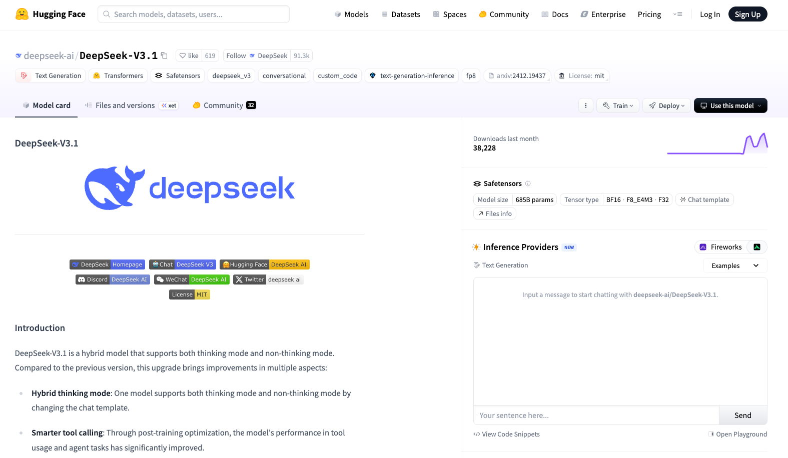

AI
--

# Hugging Face

Hugging face是当前最大的AI模型资源库，类似于：
- github是最大代码资源库
- dockerhub是最大的景象资源库

Hugging face里面共享的AI模型不仅仅是大语言模型(Large Language Model)，还要其他的模型，比如文生图的模型、文生视频的模型、图像识别的模型、机器视觉的模型等等。

比如，以下就是最新的Deepseek-v3.1的模型：


# Ollama

Ollama是一个应用程序，可以下载和管理常见的AI模型，并且在本地快速启动。Ollama的功能非常类似于Docker.

## AI模型
AI模型的使用简单来说包含了三层：
- `模型本身`，只是包含了知识与信息的文件，如 .bin, .safetensors, .pt 等文件，模型文件是不能直接运行的，
- `执行框架`，也叫学习框架、推理框架，比如transformer, PyTorch, Tensorflow, llama.cpp等等，这些框架能够加载模型文件，进行推理演算并返回结论。这些框架本身也就是各种库函数，比如python的各种库文件，
```python
# 1. 使用 Ollama (最简单)
import requests
response = requests.post("http://localhost:11434/api/generate", 
                        json={"model": "deepseek-coder", "prompt": "你好"})

# 2. 使用 Transformers (很常用)
from transformers import AutoModelForCausalLM
model = AutoModelForCausalLM.from_pretrained("/path/to/deepseek-model")

# 3. 使用 llama.cpp (高性能)
from llama_cpp import Llama
llm = Llama(model_path="deepseek-model.gguf")

# 4. 使用 PyTorch (最底层)
import torch
model = torch.load("deepseek-model.pth")
# ... 还需要自己实现tokenization、推理逻辑等
```
- `人机交互`，使用框架加载模型的过程就是`部署`,模型部署完成之后，需要和人进行交互，这就是各种AI产品，比如Chatgpt和Deepseek的网站和APP,

目前，对于AI模型的使用方式主要有三种：
- 在本地通过代码调用执行框架加载模型（即本地部署），然后使用代码进行问答和推理；
- 使用代码调用云端部署的模型API进行问答和推理，通常需要购买，获取API Key来调用；
- 通过GUI进行直接交互，比如Chatgpt和Deepseek的网站或APP;

为了简化模型从部署到交互的整个过程，ollama作为一个应用软件，提供了下载管理模型文件、使用框架加载模型、启用本地API服务等等功能，起作用非常类似docker.

## Ollama的使用
Ollama的github官网提供不同操作系统的安装包，可以直接下载安装


ollama安装完成后，使用`ollama -h`可以查看ollama的常用命令，非常类似docker命令，简单明了
```commandline
% ollama help
Large language model runner

Usage:
  ollama [flags]
  ollama [command]

Available Commands:
  serve       Start ollama
  create      Create a model
  show        Show information for a model
  run         Run a model
  stop        Stop a running model
  pull        Pull a model from a registry
  push        Push a model to a registry
  list        List models
  ps          List running models
  cp          Copy a model
  rm          Remove a model
  help        Help about any command

Flags:
  -h, --help      help for ollama
  -v, --version   Show version information

Use "ollama [command] --help" for more information about a command.
```

`ollama list`查询当前已经下载到本地的模型
```commandline
% ollama list
NAME                 ID              SIZE      MODIFIED
qwen3-coder:30b      ad67f85ca250    18 GB     2 weeks ago
deepseek-r1:14b      c333b7232bdb    9.0 GB    3 weeks ago
qwen2.5-coder:14b    9ec8897f747e    9.0 GB    3 weeks ago
qwen3:14b            bdbd181c33f2    9.3 GB    3 weeks ago
qwen2.5-coder:32b    b92d6a0bd47e    19 GB     3 weeks ago
deepseek-r1:7b       755ced02ce7b    4.7 GB    4 weeks ago
```

`ollama pull`下载一个模型文件
```commandline
% ollama pull deepseek-r1:1.5b
pulling manifest
pulling manifest
pulling manifest
pulling manifest
pulling manifest
pulling manifest
pulling manifest
pulling manifest
pulling manifest
pulling manifest
pulling manifest
pulling manifest
pulling aabd4debf0c8:  55% ▕█████████████████████████████████████████████████████                                             ▏ 612 MB/1.1 GB  2.2 MB/s   3m50s
```
`ollama run`运行一个模型，比如运行一个qwen3:14b的模型，然后就可以在命令行下面提问交互了：
```commandline
% ollama run qwen3:14b
>>> 你是谁？
Thinking...
好的，用户问我是谁。首先，我需要明确自己的身份，但不需要透露太多隐私信息。应该以友好、自然的方式回应，让用户了解我的基本功能和特点。

接下来，我应该用简单明了的语言介绍自己，比如提到我是Qwen，是由通义实验室研发的超大规模语言模型。同时，要突出我的能力，比如回答问题、创作文字、编程等，让用户知道我可以提供哪些帮助。

另外，要注意语气友好，避免使用过于正式或生硬的表达。可以加入一些表情符号或轻松的措辞，让对话更亲切。比如用“😊”或“很高兴见到你！”这样的表达。

还要考虑用户可能的后续问题，比如他们可能想了解我的具体应用场景或如何使用我的功能。因此，回应中可以适当引导用户提问，比如“有什么我可以帮你的吗？”这样既开放又鼓励进一步交流。

最后，检查回应是否符合公司的指导原则，确保没有泄露任何敏感信息，同时保持专业和友好的态度。确保回答简洁，不过于冗长，让用户能快速理解我的身份和能力。
...done thinking.

你好！我是Qwen，是由通义实验室研发的超大规模语言模型。我能够回答各种问题、创作文字、编程、推理、聊天等，旨在为用户提供全面的帮助。😊 有什么我可以帮你的吗？

>>> Send a message (/? for help)
```
`ollama ps`查询当前正在运行的模型
```commandline
% ollama ps
NAME         ID              SIZE     PROCESSOR    CONTEXT    UNTIL
qwen3:14b    bdbd181c33f2    10 GB    100% GPU     4096       2 minutes from now
```
`ollama stop`停止当前正在运行的模型
```commandline
% ollama stop qwen3:14b
% ollama ps
NAME    ID    SIZE    PROCESSOR    CONTEXT    UNTIL
```

## 关于Ollama的模型和本地部署成本

以上是ollama官网的deepseek-r1模型，同样的模型有不同的`规格`，比如：
- deepseek-r1:671b，表示它的参数量有671b，模型文件大小有404GB，部署需要大概400G左右的显存或内存；
- deepseek-r1:32b，表示它的参数量有32b，模型文件大小有20GB，部署需要大概20G左右的显存或内存；
- deepseek-r1:14b，表示它的参数量有14b，模型文件大小有9GB，部署需要大概8~9G左右的显存或内存；

以此类推。ollama使用的模型一般是.gguf格式，可以使用Hugging face下载的其他格式的模型文件创建适合ollama使用的.gguf格式的模型。


目前，AI模型的本地部署主要使用Nvidia的显卡，能够部署多大的模型取决于显卡搭载的显存容量，如果模型大小大于显存，就会调用系统的内存，这时模型的响应速度就会剧降，俗称`爆显存`，比如deepseek-r1:32b可以在HD5090上部署，但部署在HD5080上就会爆显存。

目前，消费级显卡的规格和市场价格大概是：

| 显卡   | 显存 | 价格           |
|------|----|--------------|
| HD 5090 | 32G | 20000 - 30000 |
| HD 5090 DD | 24G | 16000 - 20000 |
| HD 5080 DD | 16G | 8000 - 12000 |

专业计算卡的规格和价格大概是：

| 显卡          | 显存  | 价格              |
|-------------|-----|-----------------|
| NVIDIA H100 | 80G | 170000 - 180000 |
| NVIDIA A100 | 80G | 130000 - 140000 |

Mac家族的规格和价格大概是：

| 显卡              | 内存   | 价格    |
|-----------------|------|-------|
| Mac mini M4     | 32G  | 9000  |
| Mac mini M4 Pro | 64G  | 15500 |
| Mac Studio      | 96G  | 33000 |
| Mac Studio      | 512G | 75000 |

而且Mac家族使用的是统一内存，其内存可以给CPU和GPU共用，而不会出现爆显存的情况，所以Mac mini是目前本地部署大模型性价比最高的选项，当然其响应速度（返回token的速率）比Nvidia显卡会略低一点。

> 不同模型有不同的智能程度，一般来说参数越多越聪明，但体积也越大，部署成本就越高。相同模型在不同硬件资源上部署后的响应速度，即返回token的速度也是不同的，一般来说，要流畅的运行问答，需要响应速度至少在`10 token/s`以上，低于这个速度时，响应过慢，难以满足实际使用需求。

# Open WebUI

Ollama提供的交互方式是命令行，对普通用户不友好，大家更习惯的还是类似Chatgpt和Deepseek那样的Web网页，所以Ollama的公司提供了一个专门用于大模型聊天交互的Web程序，最早叫OllamaUI，后来改名Open WebUI。

Open WebUI的安装方式有多种，最简单的方式是使用docker安装：
```commandline
docker run -d -p 3000:8080 --add-host=host.docker.internal:host-gateway -v open-webui:/app/backend/data --name open-webui --restart always ghcr.io/open-webui/open-webui:main
```
然后使用浏览器访问`http://localhost:3000`，就可以得到和Chatgpt、Deepseek官网近乎相同的使用体验


你可以在WebUI上直接选择要使用的模型，非常方便（当心不要同时开启过多模型，不然会爆显存、内存的）


还可以查看不同模型本地部署时的响应速度


# Continue plugin


